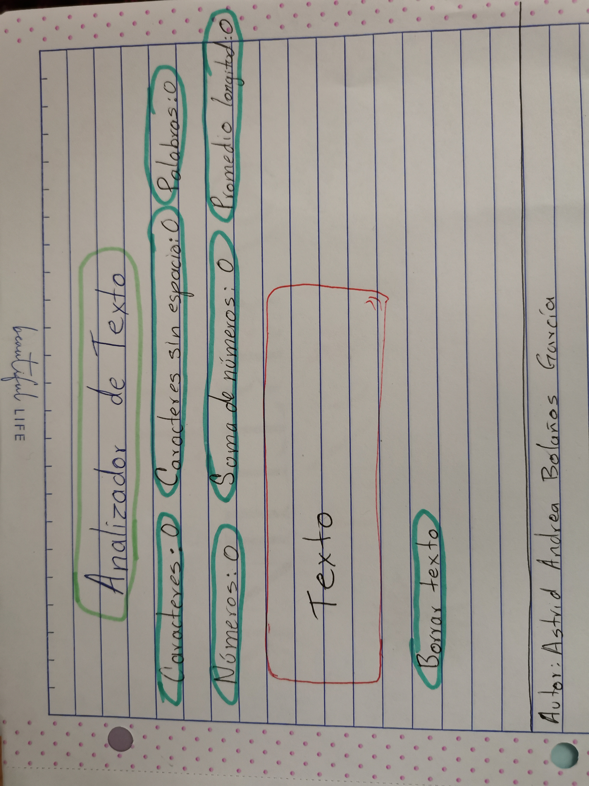
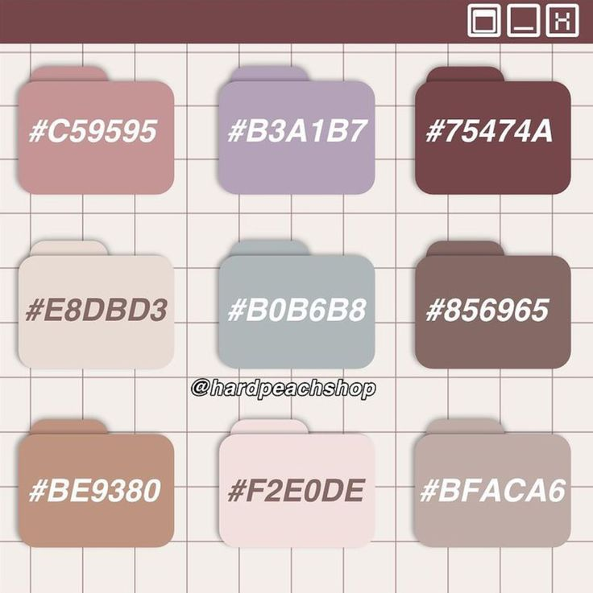

# Analizador de texto

## Índice

* [1. Objetivos](#1-Objetivos)
* [2. Preámbulo](#2-preámbulo)
* [3. Funcionalidades](#3-funcionalidades)
* [4. Desiciones de diseño](#4-Desiciones-de-siseño)

***

## 1. Objetivos

Hacer un Analizador de texto que nos permita:
* Contar caracteres con espacios y sin espacios.
* Contar las palabras que contiene el texto.
* Contar cuántos números hay en nuestro texto considerando como números cifras de más de un caracter y números decimales.
* Hacer la suma de los números detectados.
* Realizar una longitud promedio de las palabras analizadas.
* Diseñar y desarrollar un producto poniendo a las usuarias en el centro.

## 2. Preámbulo

_Credito: Anónimo, imágen extraída de [Wordpress](https://cursotextosdigitales.files.wordpress.com/2020/08/produccion-de-textos.png)_

El análisis de texto es un proceso que consiste en analizar los textos para extraer de ellos datos legibles por los sistemas informáticos.

Es útil para cualquier tipo de escritor (autor, periodista, investigador, etc.) que escribe textos con un determinado número mínimo y/o máximo de palabras. Ayuda a iddentificar la repetición innecesaria de algunas palabras y promueve una mejor armonización de la terminología utilizada. Incluso podrían calcular fácilmente el precio de un texto en función de las tarifas por palabra.

Esta herramienta también está destinada a los profesores, para quienes es útil evaluar el nivel de dificultad y la habilidad requerida para comprender un texto.

Las empresas lo utilizan para medir las opiniones de los clientes, hacer revisiones de los productos y recolectar comentarios que faciliten el análisis de sentimientos y la toma de decisiones basadas en datos.

## 3. Funcionalidades

Este analizador de texto es muy fácil de usar. Simplemente copie y pegue el texto o escríbalo directamente en el cuadro de texto, los datos se mostrarán al momento en que se detecte que tiene contenido.

La aplicación calcula las siguientes métricas y actualiza el resultado en tiempo real a medida que el usuario escribe su texto:

  **Recuento de caracteres**: la aplicación cuenta el número de caracteres en el texto de entrada, incluidos espacios y signos de puntuación.
  
  **Recuento de caracteres excluyendo espacios y signos de puntuación**: la aplicación debe cuenta el número de caracteres en el texto de entrada, excluyendo espacios y signos de puntuación.  

  **Recuento de palabras**: la aplicación cuenta el número de palabras en el texto de entrada.
  
  **Recuento de números**: la aplicación cuenta cuántos números hay en el texto de entrada, va a considerar como un sólo número las cifras que entren, hasta que sea separada por un espacio.

  **Suma total de números**: la aplicación va sumando todos los números que hay en el texto de entrada.

  **Longitud media de las palabras**: la aplicación calcula la longitud media de las palabras en el texto de entrada 

La aplicación permite borrar el contenido de la caja de texto y de las métricas haciendo click en el boton "Borrar texto".

## 4. Desiciones de diseño

Hice el prototipo de baja fidelidad con la estructura que quería que tuviera para guiarme al momento de realizar el HTML

**Paleta de colores**: 

Para que la página de la aplicación tuviera armonía, elegí una paleta de colores suaves que combinaran entre si en conjunto con la imágen de fondo. Dejar la aplicación sólo con color de fondo, me dió la sensación de que sería aburrido para el usuario, y como los analizadores de texto generalmente son utilizados por escritores o estudiantes, quise darle un toque más acogedor y animado con una imagen de fondo que representara un escritorio visualmente estética, descargué dicha imagen de canva.

 Paleta de colores _Credito: HardPeach, imágen extraída de [Blog](https://blog.hardpeach.com/codigos-color-para-anadir-boligrafos-digitales/)_
 

